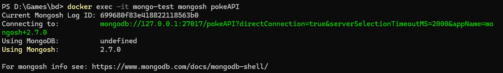
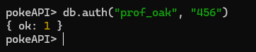
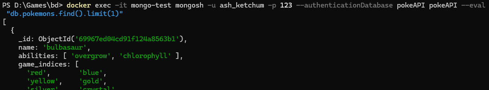
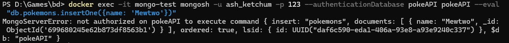
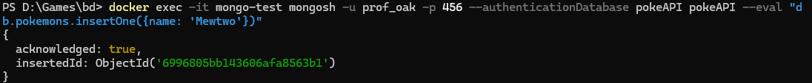

# Controle de Acesso e Inicialização Automática - MongoDB + Docker

Este projeto consiste na implementação de uma solução robusta de **autenticação, autorização e inicialização automática de dados** utilizando exclusivamente mecanismos nativos do MongoDB. O ambiente é orquestrado via Docker, simulando um cenário real de administração de bancos de dados NoSQL.

## 🏛️ Arquitetura do Projeto

A solução utiliza o modelo **RBAC (Role-Based Access Control)** para gerenciar permissões. A infraestrutura é composta por:

* **MongoDB Server**: Instância principal com autenticação habilitada (`--auth`).
* **Mongo Express**: Interface visual para conferência dos dados (acessível em `localhost:8081`).
* **Scripts de Inicialização**: Localizados em `./docker-entrypoint-initdb.d`, executados automaticamente no primeiro boot do contêiner.

### Estrutura de Diretórios

```text
.
├── docker-compose.yml
├── docker-entrypoint-initdb.d/
│   ├── 01-create-roles.js    # Definição de privilégios customizados
│   ├── 02-create-users.js    # Criação de usuários (Ash, Prof Oak e Psyduck)
│   ├── 03-insert-data.js     # Ingestão da base de dados PokeAPI
└── README.md

```

---

## 🚀 Como Executar

1. **Subir o ambiente:**
```bash
docker-compose up -d

```


2. **Resetar o ambiente (se necessário):**
Para rodar os scripts de inicialização novamente, é preciso remover o volume persistente:
```bash
docker-compose down -v

```

3. **Entrar no Container:**
Caso queira entrar no container e executar os comandos dentro dele:
```bash
docker exec -it mongo-test mongosh pokeAPI

```



4. **Logando Usuário:**
Para logar em algum usuário basta dizer qual o id e a senha:
```bash
db.auth("prof_oak", "456")

```


---

## 🔒 Segurança e Controle de Acesso

Foram configurados três níveis de acesso distintos para demonstrar a autorização nativa:

| Usuário | Senha | Papel (Role) | Permissões |
| --- | --- | --- | --- |
| `admin` | `admin` | `root` | Controle total sobre o servidor (SGBD). |
| `prof_oak` | `456` | `pokedexManager` | Leitura e Escrita na coleção `pokemons`. |
| `ash_ketchum` | `123` | `pokedexReader` | **Apenas Leitura** na coleção `pokemons`. |

---

## 🧪 Casos de Teste (Demonstração)

Abaixo, os comandos para validar a implementação via terminal (`mongosh`):

### 1. Teste de Leitura (Permitido para todos)

Conecte-se como `ash_ketchum` e liste os pokémons:

```bash
docker exec -it mongo-test mongosh -u ash_ketchum -p 123 --authenticationDatabase pokeAPI pokeAPI --eval "db.pokemons.find().limit(1)"

```



### 2. Teste de Escrita Negada (Privilégio Insuficiente)

Tente inserir um pokémon com o usuário `ash_ketchum`:

```bash
docker exec -it mongo-test mongosh -u ash_ketchum -p 123 --authenticationDatabase pokeAPI pokeAPI --eval "db.pokemons.insertOne({name: 'Mewtwo'})"

```

*Esperado: Erro `MongoServerError[Unauthorized]`.*



### 3. Teste de Escrita Permitida (Privilégio Adequado)

Tente inserir o mesmo pokémon com o usuário `prof_oak`:

```bash
docker exec -it mongo-test mongosh -u prof_oak -p 456 --authenticationDatabase pokeAPI pokeAPI --eval "db.pokemons.insertOne({name: 'Mewtwo'})"

```

*Esperado: Objeto inserido com sucesso.*



---

## ⚙️ Ingestão Automática de Dados

O processo de carga inicial é realizado através do script `03-insert-data.js`. Ele garante que, assim que o serviço estiver disponível, a base `pokeAPI` já contenha a coleção `pokemons` populada, simulando o provisionamento automático de sistemas em produção.

## Prints de algumas partes do funcionamento


